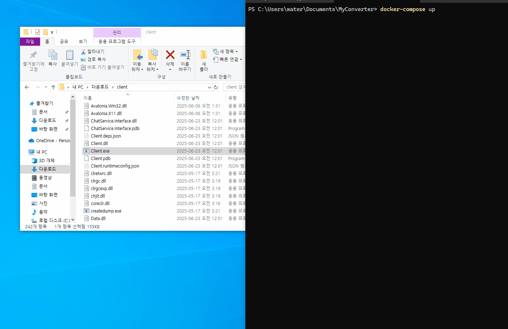
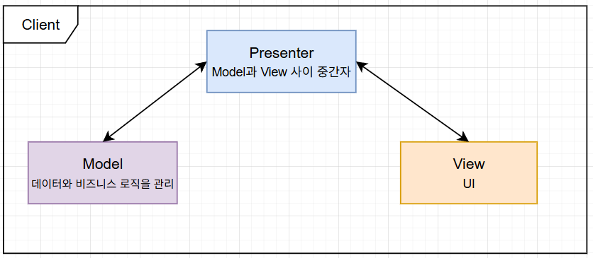

# ChatApp

[지원 포지션: Toss 백엔드 서버 개발자](https://toss.im/career/job-detail?job_id=6600650003)

**ChatApp**은 Toss의 백엔드 서버 개발자 포지션 지원을 위해 제작한 포트폴리오 프로젝트입니다.  
gRPC 및 MagicOnion에 대한 이해를 바탕으로, 실제 사용 가능한 클라이언트-서버 구조를 설계하고 구현했습니다.

.NET 환경에서 **ASP.NET Core 기반의 gRPC 서버**, **Avalonia UI 클라이언트**, **SQLite 기반 데이터 저장소**로 구성되어 있으며,  
계층 분리 및 유지보수에 용이한 구조를 구현했습니다.

### 🧠 아키텍처 개요

- `MagicOnion` 라이브러리를 사용해 C# 친화적인 인터페이스 기반 RPC를 구현하였습니다.
- `autofac` 라이브러리를 사용해 **종속성 역전 원칙(Inversion of Control, IoC)**을 적용하여 컴포넌트 간 결합도를 낮추고 유지보수성과 확장성을 높였습니다.



---

## 🚀 실행 방법

1. 레포지토리 클론

```bash
  git clone https://github.com/waterpare833/chat-app.git
  cd chat-app
```

2. 서버 실행 (Docker Compose)

```bash
  docker-compose up
```

3. 클라이언트 실행

- [Releases 페이지](https://github.com/waterpare833/chat-app/releases/tag/v0.0.1)에서 `Client.zip` 다운로드
- 압축 해제 후 `Client.exe` 실행

---

## ⚙️ 기술 스택

- **C# / .NET 9**
- **ASP.NET Core** – 백엔드 서버
- **MagicOnion (gRPC)** – 고성능 RPC 통신
- **Autofac** – 의존성 주입(Dependency Injection)
- **SQLite** – 로컬 데이터 저장
- **Avalonia UI** – 클라이언트 UI
- **Docker / GitHub Container Registry** – 컨테이너 배포
- **xUnit** – 단위 테스트

---

## 📂 프로젝트 구성

- `Data` : 도메인 모델 정의 (예: User)
- `Repository` : SQLite 기반 저장소 구현
- `Repository.Tests` : 저장소 기능 단위 테스트
- `DB.Interface` : 데이터 처리용 gRPC 인터페이스 정의
- `DB` : 데이터 처리 서버 구현
- `ChatService.Interface` : 실시간 채팅용 인터페이스 정의
- `ChatService` : 실시간 채팅 서버
- `Client` : UI 및 서버 통신 구현 (Avalonia 기반)


---

## 🖥️ 클라이언트 구조 및 구현

- Avalonia UI 기반 Model-Presenter-View 패턴으로 설계, Presenter가 Model과 View 사이를 중재함
- `r3` 라이브러리를 활용해 Observable 구독 방식으로 데이터 흐름과 상태 관리 구현



---

## ✅ 주요 구현 내용

### 🔐 인증 (Authentication)

- 사용자 **회원가입** 기능 구현
- 사용자 **로그인** 기능 구현

### 💾 데이터 저장소 (Persistence)

- **SQLite 기반 저장소(Repository)** 프로젝트 구성
- 사용자 정보 **저장 및 조회 로직 구현**
- 저장소에 대한 **단위 테스트 작성** (`xUnit`)

### 📡 네트워크 및 실시간 통신 (Networking & Realtime)

- MagicOnion 기반 사용자 인증 및 데이터 처리 서버 구현 (`db`)
- MagicOnion StreamingHub 기반 실시간 채팅 서버 구현 (`chat-service`)

---

## 🐳 Docker 정보

- DB 이미지: `ghcr.io/waterpare833/chat-app/db:latest`
- Chat Server 이미지: `ghcr.io/waterpare833/chat-app/chat-service:latest`

---

## 📎 관련 링크

- 🔗 [Toss 채용 공고](https://toss.im/career/job-detail?job_id=6600650003)
- 📦 [GitHub Repository](https://github.com/waterpare833/chat-app)
- 🧊 [DB Docker Image](https://github.com/users/waterpare833/packages/container/package/chat-app%2Fdb)
- 💬 [ChatService Docker image](https://github.com/users/waterpare833/packages/container/package/chat-app%2Fchat-service)
- 🖥️ [Avalonia 클라이언트 릴리스](https://github.com/waterpare833/chat-app/releases/tag/v0.0.1)