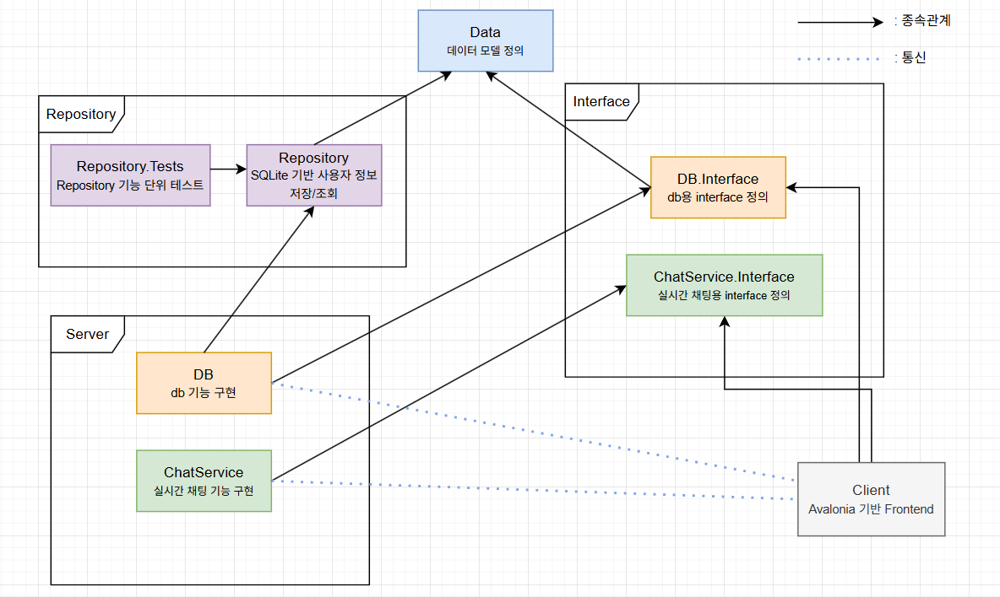

# ChatApp

ChatApp은 사용자가 실시간으로 메시지를 주고받을 수 있는 채팅 애플리케이션입니다.

단순한 기능 구현을 넘어서, 실제 서비스 수준의 구조를 목표로 설계한 프로젝트입니다. 

클라이언트-서버 구조와 실행 환경을 직접 구성하고 구현했습니다.

### 🧠 아키텍처 개요

- **빠르고 안정적인 통신 방식**을 사용해 서버와 클라이언트가 효율적으로 메시지를 주고받을 수 있도록 했습니다. *(gRPC 기반, [MagicOnion](https://github.com/Cysharp/MagicOnion) 라이브러리 사용)*
- **구성 요소 간의 의존성을 줄이는 설계 방식**으로 유지보수가 쉽고 기능 확장이 용이한 구조를 만들었습니다. *(DI 패턴 적용, [Autofac](https://github.com/autofac/Autofac) 사용)*
- **경량의 내장형 데이터베이스**를 사용해 사용자 정보를 안전하게 로컬에 저장했습니다. s(파일 기반 저장 방식인 [SQLite](https://learn.microsoft.com/ko-kr/dotnet/standard/data/sqlite/?tabs=net-cli) 사용)
- **Docker 컨테이너**를 이용해 서버 실행 환경을 표준화하고, 누구나 동일한 방식으로 실행할 수 있도록 구성했습니다.
- 사용자 인터페이스는 **Windows와 macOS 모두에서 실행 가능한 멀티플랫폼 UI 프레임워크**인 [Avalonia UI](https://github.com/AvaloniaUI/Avalonia)를 사용하여 구현했습니다.


---

## 🚀 실행 방법

1. 레포지토리 클론

```bash
  git clone https://github.com/waterpare833/chat-app.git
  cd chat-app
```

2. 서버 실행 (Docker Compose)

```bash
  docker-compose up
```

3. 클라이언트 실행

- [Releases 페이지](https://github.com/waterpare833/chat-app/releases/tag/v0.0.1)에서 `Client.zip` 다운로드
- 압축 해제 후 `Client.exe` 실행

---

## ⚙️ 기술 스택

- **C# / .NET 9**
- **ASP.NET Core** – 백엔드 서버
- **MagicOnion (gRPC)** – 고성능 RPC 통신
- **Autofac** – 의존성 주입(Dependency Injection)
- **SQLite** – 로컬 데이터 저장
- **Avalonia UI** – 클라이언트 UI
- **Docker / GitHub Container Registry** – 컨테이너 배포
- **xUnit** – 단위 테스트

---

## 📂 프로젝트 구성

- `Data` : 도메인 모델 정의 (예: User)
- `Repository` : SQLite 기반 저장소 구현
- `Repository.Tests` : 저장소 기능 단위 테스트
- `DB.Interface` : 데이터 처리용 gRPC 인터페이스 정의
- `DB` : 데이터 처리 서버 구현
- `ChatService.Interface` : 실시간 채팅용 인터페이스 정의
- `ChatService` : 실시간 채팅 서버
- `Client` : UI 및 서버 통신 구현 (Avalonia 기반)



---

## 🖥️ 클라이언트 구조 및 구현

- Avalonia UI 기반 Model-Presenter-View 패턴으로 설계, Presenter가 Model과 View 사이를 중재함
- `r3` 라이브러리를 활용해 Observable 구독 방식으로 데이터 흐름과 상태 관리 구현


---

## ✅ 주요 구현 내용

### 🔐 인증 (Authentication)

- 사용자 **회원가입** 기능 구현
- 사용자 **로그인** 기능 구현

### 💾 데이터 저장소 (Persistence)

- **SQLite 기반 저장소(Repository)** 프로젝트 구성
- 사용자 정보 **저장 및 조회 로직 구현**
- 저장소에 대한 **단위 테스트 작성** (`xUnit`)

### 📡 네트워크 및 실시간 통신 (Networking & Realtime)

- MagicOnion 기반 사용자 인증 및 데이터 처리 서버 구현 (`db`)
- MagicOnion StreamingHub 기반 실시간 채팅 서버 구현 (`chat-service`)

---

## 🐳 Docker 정보

- **DB 이미지**: `ghcr.io/waterpare833/chat-app/db:latest`\
  - **Port**: `5058`
- **Chat Server 이미지**: `ghcr.io/waterpare833/chat-app/chat-service:latest`\
  - **Port**: `7028`

---

## 📎 관련 링크

- 📦 [GitHub Repository](https://github.com/waterpare833/chat-app)
- 🧊 [DB Docker Image](https://github.com/users/waterpare833/packages/container/package/chat-app%2Fdb)
- 💬 [ChatService Docker image](https://github.com/users/waterpare833/packages/container/package/chat-app%2Fchat-service)
- 🖥️ [Avalonia 클라이언트 릴리스](https://github.com/waterpare833/chat-app/releases/tag/v0.0.1)